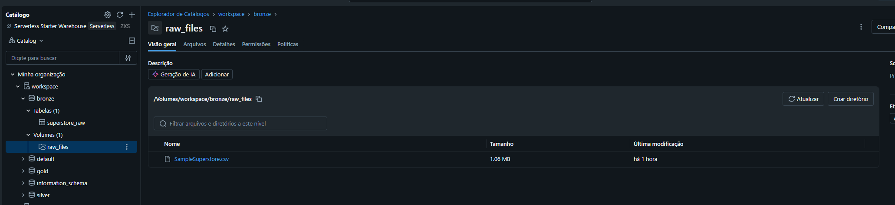
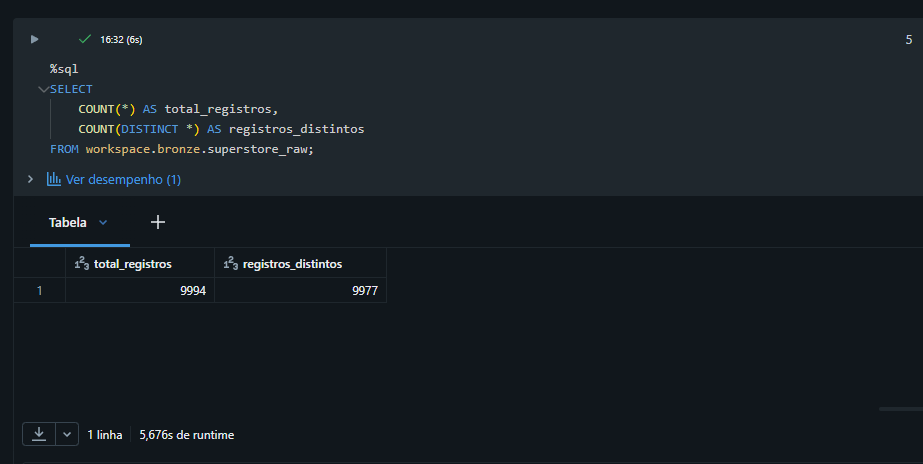
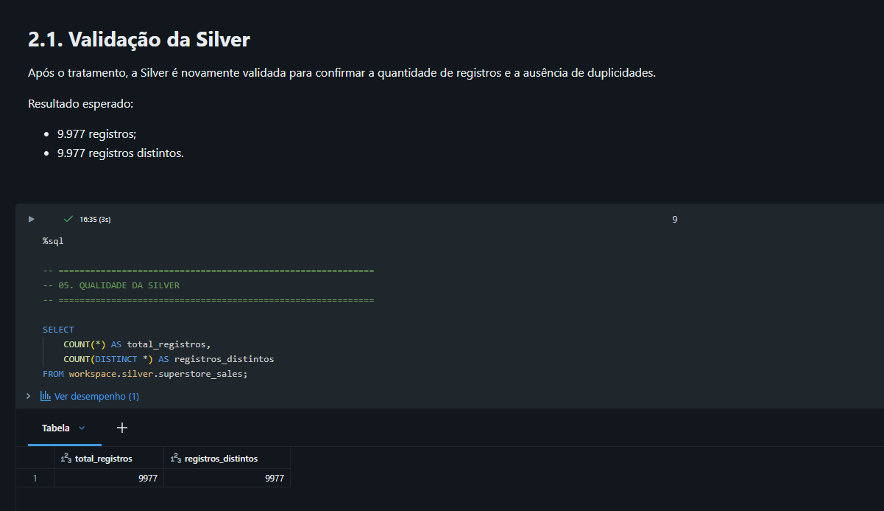
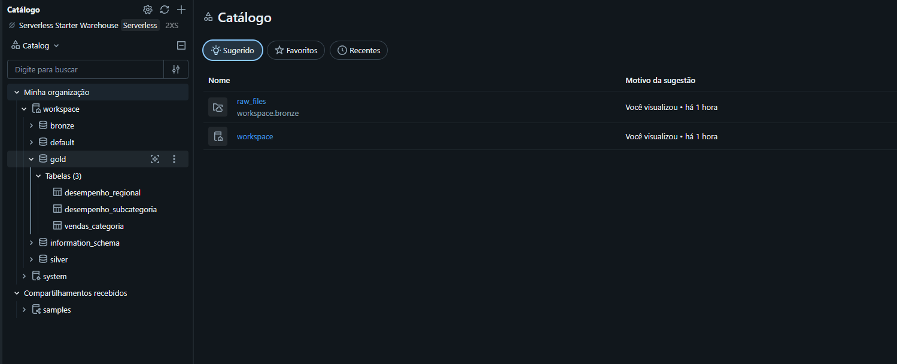
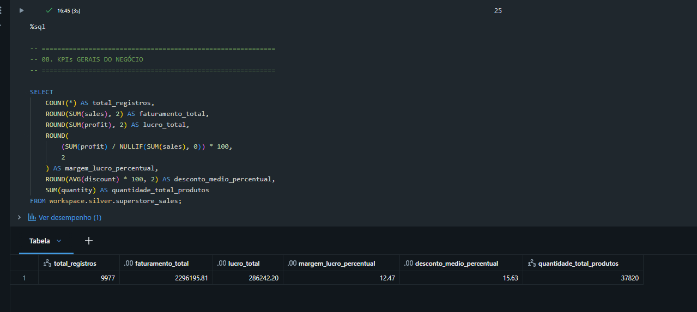
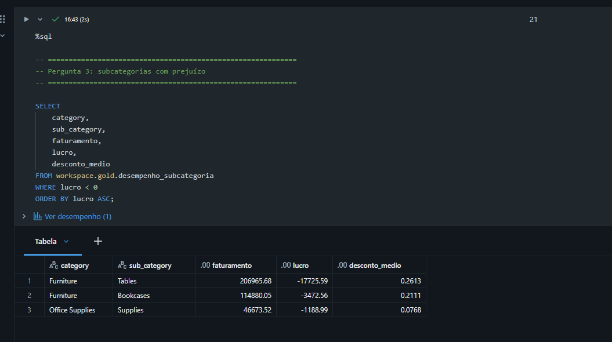

# MVP Superstore — Engenharia de Dados com Databricks

MVP de Engenharia de Dados desenvolvido utilizando Databricks, arquitetura Medallion (Bronze, Silver e Gold), SQL e GitHub.

---

## 1. Context & Questions

### Contexto

Este projeto tem como objetivo construir um pipeline de dados utilizando o dataset **Sample Superstore**, disponibilizado em formato CSV.

O projeto parte de dados de vendas e transforma os dados brutos em informações estruturadas para análise de faturamento, lucro, descontos e desempenho comercial.

A arquitetura utilizada segue o modelo Medallion:

```text
                    SampleSuperstore.csv
                            |
                            v
                    +---------------+
                    |    BRONZE     |
                    | Dados brutos  |
                    +---------------+
                            |
                            | Limpeza,
                            | padronização
                            | e deduplicação
                            v
                    +---------------+
                    |    SILVER     |
                    | Dados tratados|
                    +---------------+
                            |
                            | Agregações
                            | e métricas
                            v
                    +---------------+
                    |     GOLD      |
                    | Dados para    |
                    | análise       |
                    +---------------+
```

### Perguntas de negócio

O projeto busca responder às seguintes perguntas:

1. Quais categorias apresentam maior faturamento e lucro?
2. Quais regiões apresentam maior faturamento e lucro?
3. Quais subcategorias apresentam prejuízo?
4. Quais subcategorias apresentam maiores margens de lucro?
5. Qual é o resultado geral das vendas?
6. Como os descontos se distribuem entre categorias e regiões?

---

## 2. Data Load

### Fonte dos dados

O dataset utilizado foi o **Sample Superstore**, obtido através do Kaggle.

Arquivo utilizado:

```text
SampleSuperstore.csv
```

Fonte:

Kaggle — Sample Superstore

https://www.kaggle.com/datasets/xubao666/superstore

O arquivo foi carregado para um **Databricks Volume**, permitindo que os dados fossem armazenados em ambiente de nuvem e utilizados pelo pipeline.

### Armazenamento

O arquivo foi armazenado no seguinte caminho:

```text
/Volumes/workspace/bronze/raw_files/SampleSuperstore.csv
```

### Características do dataset

O dataset contém informações relacionadas a:

- modalidade de envio;
- segmento;
- país;
- cidade;
- estado;
- código postal;
- região;
- categoria;
- subcategoria;
- vendas;
- quantidade;
- desconto;
- lucro.

O dataset possui originalmente **9.994 registros** e **13 atributos**.

### Licença

A utilização do dataset deve considerar a licença e as condições de uso informadas na página original do dataset no Kaggle.

---

## 3. Modeling & Data Catalog

O projeto utiliza três camadas:

### Bronze

Tabela:

```text
workspace.bronze.superstore_raw
```

A camada Bronze representa os dados carregados a partir do arquivo original, mantendo a estrutura próxima da fonte.

Foi realizada apenas uma padronização técnica dos nomes das colunas para facilitar o processamento posterior.

Exemplos:

```text
Ship Mode     -> ship_mode
Postal Code   -> postal_code
Sub-Category  -> sub_category
```

### Silver

Tabela:

```text
workspace.silver.superstore_sales
```

A camada Silver contém os dados tratados, padronizados e sem registros duplicados.

Foram aplicados:

- remoção de duplicidades;
- conversão de tipos;
- padronização dos nomes;
- validação de valores;
- filtragem de registros inválidos.

### Gold

Foram criadas três tabelas analíticas:

```text
workspace.gold.vendas_categoria
workspace.gold.desempenho_regional
workspace.gold.desempenho_subcategoria
```

Essas tabelas agregam os dados da Silver para facilitar consultas analíticas e responder às perguntas definidas no projeto.

---

## Data Catalog

### Tabela: workspace.silver.superstore_sales

| Campo | Tipo | Descrição |
|---|---|---|
| ship_mode | STRING | Modalidade de envio utilizada no pedido |
| segment | STRING | Segmento do cliente |
| country | STRING | País da venda |
| city | STRING | Cidade da venda |
| state | STRING | Estado da venda |
| postal_code | STRING | Código postal |
| region | STRING | Região geográfica |
| category | STRING | Categoria do produto |
| sub_category | STRING | Subcategoria do produto |
| sales | DECIMAL(18,2) | Valor da venda |
| quantity | INT | Quantidade de produtos vendidos |
| discount | DECIMAL(5,2) | Percentual de desconto aplicado |
| profit | DECIMAL(18,2) | Lucro ou prejuízo da venda |

### Regras aplicadas

- `sales` deve ser maior que zero.
- `quantity` deve ser maior que zero.
- `discount` deve estar entre 0 e 1.
- Registros duplicados são removidos.
- Campos numéricos recebem tipos apropriados.
- `postal_code` é tratado como texto para evitar perda de representação do código.

### Linhagem

```text
SampleSuperstore.csv
        |
        v
workspace.bronze.superstore_raw
        |
        v
workspace.silver.superstore_sales
        |
        +----------------------+
        |                      |
        v                      v
vendas_categoria       desempenho_regional
        |
        v
desempenho_subcategoria
```

---

## 4. Pipeline

O pipeline foi desenvolvido em um **Databricks Notebook**, utilizando SQL.

Notebook:

```text
MVP_Superstore_Pipeline
```

O fluxo executado foi:

```text
1. Upload do CSV
       |
       v
2. Leitura dos dados
       |
       v
3. Criação da Bronze
       |
       v
4. Validação da qualidade
       |
       v
5. Deduplicação e tratamento
       |
       v
6. Criação da Silver
       |
       v
7. Criação das tabelas Gold
       |
       v
8. Consultas analíticas
       |
       v
9. KPIs e conclusões
```

### Bronze

A tabela Bronze foi criada a partir do arquivo armazenado no Databricks Volume.

Durante essa etapa, os nomes das colunas foram padronizados para facilitar o processamento.

### Silver

Na Silver foram aplicados:

- `SELECT DISTINCT` para remoção das duplicidades;
- conversão dos campos para tipos adequados;
- filtros de qualidade;
- padronização dos campos numéricos.

Os filtros utilizados foram:

```text
sales > 0
quantity > 0
discount BETWEEN 0 AND 1
```

### Gold

Na camada Gold foram realizadas agregações por:

- categoria;
- região;
- categoria e subcategoria.

Foram calculadas métricas como:

- quantidade de vendas;
- quantidade de produtos;
- faturamento;
- lucro;
- desconto médio;
- margem de lucro.

---

## 5. Data Quality

Foram realizados testes de qualidade nas camadas Bronze e Silver.

### Bronze

Quantidade total de registros:

```text
9.994
```

Quantidade de registros distintos:

```text
9.977
```

Foram identificadas **17 duplicidades em excesso** no conjunto original.

### Valores nulos

Os testes realizados não identificaram valores nulos nos campos analisados.

### Validação de valores

Foram realizados testes para identificar:

- vendas menores ou iguais a zero;
- quantidades menores ou iguais a zero;
- descontos fora do intervalo válido;
- valores de lucro nulos.

Todos os testes apresentaram:

```text
0 ocorrências inválidas
```

### Tratamento

As duplicidades foram removidas durante a construção da Silver.

Registros com:

```text
sales <= 0
quantity <= 0
discount < 0
discount > 1
```

foram excluídos da camada tratada.

Valores de lucro negativos foram mantidos, pois representam situações de prejuízo e são relevantes para a análise de rentabilidade.

### Resultado da Silver

Após o tratamento:

```text
Total de registros:    9.977
Registros distintos:   9.977
Valores nulos:              0
```

Portanto, a Silver apresenta registros únicos e passou pelas validações de qualidade definidas no projeto.

---

## 6. Data Analysis

As análises foram realizadas sobre as tabelas da camada Gold, utilizando SQL no Databricks.

### Pergunta 1 — Quais categorias apresentam maior faturamento e lucro?

| Categoria | Faturamento | Lucro |
|---|---:|---:|
| Technology | 836.154,10 | 145.455,66 |
| Furniture | 741.306,50 | 18.421,79 |
| Office Supplies | 718.735,21 | 122.364,75 |

A categoria Technology apresentou o maior faturamento e também o maior lucro no conjunto analisado.

---

### Pergunta 2 — Quais regiões apresentam maior faturamento e lucro?

| Região | Faturamento | Lucro |
|---|---:|---:|
| West | 725.525,74 | 108.330,15 |
| East | 678.435,32 | 91.506,37 |
| Central | 500.782,85 | 39.655,97 |
| South | 391.721,90 | 46.749,71 |

A região West apresentou os maiores valores de faturamento e lucro entre as regiões analisadas.

---

### Pergunta 3 — Quais subcategorias apresentam prejuízo?

Foram identificadas três subcategorias com lucro negativo:

| Subcategoria | Faturamento | Lucro | Desconto médio |
|---|---:|---:|---:|
| Tables | 206.965,68 | -17.725,59 | 26,13% |
| Bookcases | 114.880,05 | -3.472,56 | 21,11% |
| Supplies | 46.673,52 | -1.188,99 | 7,68% |

Essas subcategorias representam pontos de atenção na análise de rentabilidade.

---

### Pergunta 4 — Quais subcategorias apresentam maiores margens de lucro?

A margem foi calculada pela relação entre lucro e faturamento.

Entre as maiores margens observadas estão:

| Subcategoria | Margem |
|---|---:|
| Envelopes | 42,27% |
| Copiers | 37,20% |
| Fasteners | 31,40% |
| Accessories | 25,05% |
| Art | 24,07% |

A análise permite identificar diferenças relevantes de rentabilidade entre as subcategorias.

---

### Pergunta 5 — Qual é o resultado geral das vendas?

| Indicador | Resultado |
|---|---:|
| Registros analisados | 9.977 |
| Faturamento total | 2.296.195,81 |
| Lucro total | 286.242,20 |
| Margem de lucro | 12,47% |
| Desconto médio | 15,63% |
| Quantidade total de produtos | 37.820 |

---

### Pergunta 6 — Como os descontos se distribuem entre categorias e regiões?

As médias de desconto por categoria foram:

| Categoria | Desconto médio |
|---|---:|
| Technology | 13,23% |
| Furniture | 17,40% |
| Office Supplies | 15,74% |

Por região:

| Região | Desconto médio |
|---|---:|
| West | 10,96% |
| East | 14,53% |
| Central | 24,03% |
| South | 14,73% |

Os dados mostram diferenças nos descontos médios entre categorias e regiões.

A análise descreve os valores observados, mas não permite afirmar que o desconto seja a causa direta de determinado resultado de lucro.

### Conclusão da análise

O conjunto analisado apresentou faturamento total de **2.296.195,81** e lucro total de **286.242,20**, com margem de lucro de **12,47%**.

As análises também identificaram diferenças de desempenho entre categorias, regiões e subcategorias.

Foram identificadas três subcategorias com lucro negativo:

- Tables;
- Bookcases;
- Supplies.

A camada Gold permitiu transformar os dados tratados em informações consolidadas para análise de faturamento, rentabilidade, descontos e desempenho comercial.

---

## 7. Evidence Screenshots

### Data Load



### Bronze — Data Quality



### Silver — Data Quality



### Gold — Data Modeling



### Business KPIs



### Loss-Making Subcategories



---

## 8. Self-Evaluation

### Pontos atendidos

O projeto contempla:

- definição de um problema e perguntas de negócio;
- coleta e armazenamento dos dados em ambiente cloud;
- utilização de arquitetura Medallion;
- construção das camadas Bronze, Silver e Gold;
- documentação das principais entidades e campos;
- criação de pipeline em Databricks Notebook;
- tratamento e validação da qualidade dos dados;
- análises de faturamento, lucro, margem e descontos;
- documentação dos resultados;
- disponibilização do código em repositório público no GitHub;
- evidências visuais das principais etapas.

### Limitações

O projeto foi desenvolvido como um MVP e utiliza um dataset estático.

Dessa forma, o pipeline não contempla neste momento:

- ingestão contínua;
- atualização automática dos dados;
- orquestração externa;
- monitoramento automatizado;
- integração com múltiplas fontes.

As análises realizadas também são descritivas. O projeto não busca estabelecer relações causais entre as variáveis.

---

## 9. Technologies

As principais tecnologias utilizadas foram:

- **Databricks**
- **Databricks Volumes**
- **Databricks SQL**
- **Delta Tables**
- **Unity Catalog**
- **GitHub**
- **SQL**

---

## 10. Repository Structure

```text
mvp-superstore-databricks/
│
├── MVP_Superstore_Pipeline.py
├── README.md
│
└── evidencias/
    ├── 01_dados_origem.png
    ├── 02_bronze_qualidade.png
    ├── 03_silver_qualidade.png
    ├── 04_gold_tabelas.png
    ├── 05_kpis.png
    └── 06_analise_prejuizo.png
```

---

## 11. Source

Dataset utilizado:

**Sample Superstore**

Arquivo:

```text
SampleSuperstore.csv
```

Fonte:

Kaggle

https://www.kaggle.com/datasets/xubao666/superstore

---

## 12. Project Architecture

```text
                 +----------------------+
                 | SampleSuperstore.csv |
                 +----------+-----------+
                            |
                            v
                 +----------------------+
                 | Databricks Volume    |
                 | /bronze/raw_files    |
                 +----------+-----------+
                            |
                            v
                 +----------------------+
                 | Bronze               |
                 | superstore_raw       |
                 +----------+-----------+
                            |
                            | limpeza
                            | padronização
                            | deduplicação
                            v
                 +----------------------+
                 | Silver               |
                 | superstore_sales     |
                 +----------+-----------+
                            |
                            | agregações
                            | métricas
                            v
              +-------------+-------------+
              |             |             |
              v             v             v
       vendas_categoria  desempenho_  desempenho_
                         regional     subcategoria
              |             |             |
              +-------------+-------------+
                            |
                            v
                    Análise de negócio
```

---

## 13. Final Result

O MVP demonstra um fluxo completo de Engenharia de Dados:

```text
Coleta
  ↓
Armazenamento
  ↓
Bronze
  ↓
Qualidade
  ↓
Silver
  ↓
Modelagem
  ↓
Gold
  ↓
Análise
```

O código do pipeline está disponível neste repositório e as evidências das principais etapas estão documentadas na seção de screenshots.
